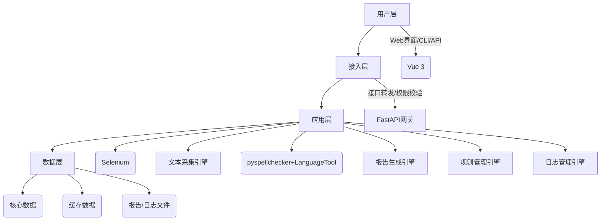
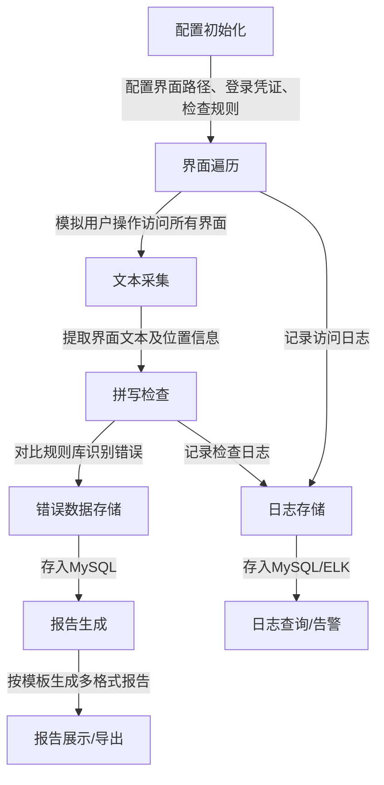
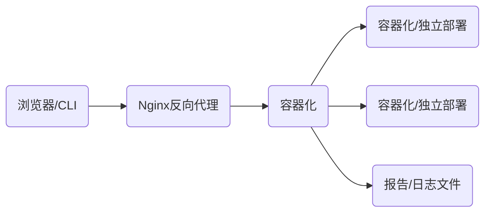

# Commerce系统界面文本拼写检查工具 技术设计文档

## 1. 文档概述

### 1.1 文档目的

本文档旨在详细阐述Commerce系统界面文本拼写检查工具的技术设计方案，明确工具的功能范围、技术选型、核心流程、数据库设计及部署运维方式，为开发、测试和维护团队提供统一的技术指导。

### 1.2 背景与需求

Commerce系统基于Bes平台构建，支撑运营商数字化转型，包含操作员登录、用户登录、360界面、offer选择、结算等多类界面，界面间跳转逻辑复杂。因开发疏忽，界面标签存在拼写错误问题，需开发一款工具实现：

- 自动遍历系统所有界面，采集界面文本内容；

- 识别文本中的拼写错误（如单词拼写错误、语法错误、专业术语错误）；

- 生成结构化的测试报告，明确错误位置、错误类型及修复建议。

### 1.3 目标用户

测试工程师、开发工程师、系统运维人员。

### 1.4 术语定义

|术语|定义|
|---|---|
|界面节点|系统中独立的界面单元（如登录界面、offer选择界面），包含唯一标识和访问路径|
|文本元素|界面上的可显示文本（如按钮文案、标签文字、提示信息）|
|拼写规则库|存储正确单词、专业术语、行业词汇的数据库，用于拼写校验|
|遍历引擎|负责自动访问系统所有界面节点的核心模块|
## 2. 功能列表

### 2.1 核心功能

|功能模块|功能描述|
|---|---|
|界面遍历模块|1. 配置界面访问路径及跳转规则； 2. 自动模拟用户操作遍历所有目标界面； 3. 记录界面访问状态（成功/失败）及耗时|
|文本采集模块|1. 解析界面DOM结构/原生组件，提取所有可见文本元素； 2. 记录文本元素所属界面、位置（XPath/组件ID）、文本内容|
|拼写检查模块|1. 基于规则库校验文本拼写正确性； 2. 识别错误类型（单词错误、术语错误、语法错误）； 3. 给出错误修复建议|
|报告生成模块|1. 生成可视化测试报告（HTML/Excel/PDF）； 2. 支持按界面、错误类型、严重程度筛选报告； 3. 导出错误明细数据|
|规则管理模块|1. 维护拼写规则库（新增/删除/修改词汇）； 2. 配置专业术语白名单（如offer、360等）； 3. 自定义错误严重程度规则|
### 2.2 辅助功能

|功能模块|功能描述|
|---|---|
|日志管理模块|1. 记录工具运行日志（界面访问日志、拼写检查日志、错误日志）； 2. 支持日志查询、导出、清理； 3. 异常日志告警（邮件/短信）|
|权限管理模块|1. 基于角色的权限控制（管理员/测试员/查看员）； 2. 控制规则库修改、报告导出、配置修改等操作权限|
|配置管理模块|1. 配置系统访问参数（基础URL、登录凭证、超时时间）； 2. 配置拼写检查规则（敏感词汇忽略、错误阈值）； 3. 配置报告模板及导出格式|
## 3. 技术选型

### 3.1 开发语言与框架

|技术类型|选型方案|选型理由|
|---|---|---|
|核心开发语言|Python 3.9+|生态丰富，拥有成熟的爬虫/界面遍历库（Selenium）、拼写检查库（pyspellchecker）、报告生成库（ReportLab/Pandas）；开发效率高，适合快速迭代|
|前端框架|Vue 3 + Element Plus|轻量易用，组件丰富，适合快速构建可视化管理界面；支持响应式布局，适配多终端|
|后端框架|FastAPI|高性能异步框架，支持自动生成API文档；类型提示完善，便于维护；轻量级，部署成本低|
|界面自动化框架|Selenium 4 + WebDriverManager|支持多浏览器（Chrome/Firefox/Edge），可模拟真实用户操作；WebDriverManager自动管理驱动版本，降低维护成本|
|拼写检查核心库|pyspellchecker + LanguageTool-Python|pyspellchecker支持离线英文拼写检查，性能高；LanguageTool支持语法、语义检查，可识别复杂错误；结合使用覆盖多类拼写问题|
### 3.2 数据库选型

|数据库类型|选型方案|选型理由|
|---|---|---|
|关系型数据库|MySQL 8.0|成熟稳定，支持事务和复杂查询；适配结构化数据存储（界面信息、拼写规则、错误记录）；社区支持完善，部署成本低|
|缓存数据库|Redis 6.0+|缓存界面访问路径、拼写规则库，提升检查效率；支持过期策略，可缓存临时运行数据（如遍历进度）|
### 3.3 部署与运维

|技术类型|选型方案|选型理由|
|---|---|---|
|容器化工具|Docker + Docker Compose|环境隔离，简化部署流程；Compose支持多服务（应用服务、数据库、缓存）一键编排|
|报告生成工具|ReportLab（PDF）、OpenPyXL（Excel）、Jinja2（HTML）|覆盖主流报告格式；Jinja2支持自定义HTML模板，适配不同报告样式需求|
|日志管理|ELK Stack（Elasticsearch + Logstash + Kibana）（可选）|集中化日志收集、分析、可视化；便于排查工具运行异常，支持日志检索和监控|
|告警工具|SMTP（邮件）、Twilio（短信）（可选）|轻量易用，适配基础告警需求；可灵活配置告警触发规则|
## 4. 系统架构设计

### 4.1 整体架构（分层架构）

### 4.2 核心流程

## 5. 数据库表设计

### 5.1 核心表结构

#### 5.1.1 界面信息表（interface_info）

|字段名|字段类型|主键/外键|非空|备注|
|---|---|---|---|---|
|id|BIGINT|主键|是|界面唯一标识|
|interface_name|VARCHAR(100)|-|是|界面名称（如“操作员登录界面”）|
|interface_path|VARCHAR(255)|-|是|界面访问路径/URL|
|parent_id|BIGINT|外键|否|父界面ID（关联本表id，用于记录跳转关系）|
|jump_rule|TEXT|-|否|跳转规则（如“点击登录按钮后跳转至用户登录界面”）|
|status|TINYINT|-|是|界面状态：0-未启用，1-启用，2-废弃|
|create_time|DATETIME|-|是|创建时间|
|update_time|DATETIME|-|是|更新时间|
|creator|VARCHAR(50)|-|是|创建人|
#### 5.1.2 文本元素表（text_element）

|字段名|字段类型|主键/外键|非空|备注|
|---|---|---|---|---|
|id|BIGINT|主键|是|文本元素唯一标识|
|interface_id|BIGINT|外键|是|关联[interface_info.id](interface_info.id)|
|element_path|VARCHAR(500)|-|是|文本元素位置（XPath/组件ID，如“//button[@id='login-btn']”）|
|text_content|TEXT|-|是|文本内容|
|element_type|VARCHAR(50)|-|是|元素类型（按钮、标签、提示框、输入框占位符等）|
|collect_time|DATETIME|-|是|采集时间|
|collect_status|TINYINT|-|是|采集状态：0-失败，1-成功|
#### 5.1.3 拼写规则库表（spell_rule）

|字段名|字段类型|主键/外键|非空|备注|
|---|---|---|---|---|
|id|BIGINT|主键|是|规则唯一标识|
|word|VARCHAR(100)|-|是|正确词汇/术语（如“offer”“结算”）|
|word_type|VARCHAR(50)|-|是|词汇类型：0-通用单词，1-行业术语，2-自定义词汇|
|is_whitelist|TINYINT|-|是|是否白名单：0-否，1-是（白名单词汇不校验）|
|remark|VARCHAR(255)|-|否|备注（如“运营商专业术语，无需校验”）|
|create_time|DATETIME|-|是|创建时间|
|update_time|DATETIME|-|是|更新时间|
#### 5.1.4 拼写错误记录表（spell_error）

|字段名|字段类型|主键/外键|非空|备注|
|---|---|---|---|---|
|id|BIGINT|主键|是|错误记录唯一标识|
|element_id|BIGINT|外键|是|关联[text_element.id](text_element.id)|
|error_text|VARCHAR(500)|-|是|错误文本内容|
|correct_suggest|TEXT|-|否|修正建议（多个建议用逗号分隔）|
|error_type|VARCHAR(50)|-|是|错误类型：0-单词拼写错误，1-术语错误，2-语法错误|
|severity_level|TINYINT|-|是|严重程度：1-低（不影响理解），2-中（轻微影响），3-高（严重影响）|
|check_time|DATETIME|-|是|检查时间|
|is_fixed|TINYINT|-|是|是否修复：0-未修复，1-已修复|
|fixed_time|DATETIME|-|否|修复时间|
#### 5.1.5 检查任务表（check_task）

|字段名|字段类型|主键/外键|非空|备注|
|---|---|---|---|---|
|id|BIGINT|主键|是|任务唯一标识|
|task_name|VARCHAR(100)|-|是|任务名称（如“20240501-全界面拼写检查”）|
|task_status|TINYINT|-|是|任务状态：0-待执行，1-执行中，2-执行完成，3-执行失败|
|start_time|DATETIME|-|否|开始时间|
|end_time|DATETIME|-|否|结束时间|
|check_scope|VARCHAR(255)|-|是|检查范围：0-全界面，1-指定界面（关联[interface_info.id](interface_info.id)）|
|error_count|INT|-|否|错误总数|
|executor|VARCHAR(50)|-|是|执行人|
|report_path|VARCHAR(255)|-|否|报告存储路径|
|error_msg|TEXT|-|否|失败原因（任务执行失败时填写）|
### 5.2 辅助表结构

#### 5.2.1 用户表（sys_user）

|字段名|字段类型|主键/外键|非空|备注|
|---|---|---|---|---|
|id|BIGINT|主键|是|用户唯一标识|
|username|VARCHAR(50)|-|是|用户名（唯一）|
|password|VARCHAR(100)|-|是|密码（加密存储，如BCrypt）|
|role_id|BIGINT|外键|是|关联角色表|
|status|TINYINT|-|是|用户状态：0-禁用，1-启用|
|create_time|DATETIME|-|是|创建时间|
#### 5.2.2 角色表（sys_role）

|字段名|字段类型|主键/外键|非空|备注|
|---|---|---|---|---|
|id|BIGINT|主键|是|角色唯一标识|
|role_name|VARCHAR(50)|-|是|角色名称（如管理员、测试员、查看员）|
|permissions|TEXT|-|否|权限标识（如rule:edit、report:export，多个用逗号分隔）|
|status|TINYINT|-|是|角色状态：0-禁用，1-启用|
#### 5.2.3 系统日志表（sys_log）

|字段名|字段类型|主键/外键|非空|备注|
|---|---|---|---|---|
|id|BIGINT|主键|是|日志唯一标识|
|log_type|VARCHAR(50)|-|是|日志类型：0-访问日志，1-操作日志，2-错误日志|
|operator|VARCHAR(50)|-|是|操作人（匿名用户填NULL）|
|operation_desc|VARCHAR(255)|-|是|操作描述（如“执行全界面拼写检查任务”）|
|request_param|TEXT|-|否|请求参数|
|ip_address|VARCHAR(50)|-|否|操作IP|
|create_time|DATETIME|-|是|日志时间|
|error_detail|TEXT|-|否|错误详情（错误日志时填写）|
## 6. 核心模块详细设计

### 6.1 界面遍历模块

1. **配置管理**：用户在前端配置界面访问路径、跳转规则（如点击按钮、输入凭证）、登录信息（账号/密码）、遍历超时时间；

2. **遍历执行**：

    - 初始化Selenium WebDriver，模拟浏览器打开系统基础URL；

    - 按配置的跳转规则自动执行操作（如输入账号密码、点击登录按钮）；

    - 递归遍历所有子界面，记录每个界面的访问状态；

    - 遇到访问失败的界面，记录失败原因（如超时、元素未找到）并跳过，继续遍历其他界面；

3. **进度监控**：实时返回遍历进度（已遍历/总界面数），支持暂停/终止遍历任务。

### 6.2 拼写检查模块

1. **规则加载**：从Redis缓存加载拼写规则库（白名单词汇、正确单词）；

2. **文本预处理**：去除文本中的特殊字符、空格，统一大小写（英文）；

3. **拼写校验**：

    - 使用pyspellchecker检查英文单词拼写错误；

    - 使用LanguageTool检查语法、语义错误；

    - 对比行业术语白名单，过滤无需校验的词汇（如“360”“offer”）；

4. **错误分级**：根据错误类型和影响范围判定严重程度（低/中/高）；

5. **建议生成**：基于规则库给出修正建议（如“offr”建议修正为“offer”）。

### 6.3 报告生成模块

1. **数据统计**：按界面、错误类型、严重程度统计错误数量；

2. **报告模板**：

    - HTML模板：包含错误概览、明细列表、界面错误分布图表；

    - Excel模板：结构化存储错误明细，支持筛选和排序；

    - PDF模板：简洁的测试报告，包含任务信息、错误统计、修复建议；

3. **报告存储**：报告文件存储在服务器本地，记录存储路径到数据库，支持在线查看和下载。

## 7. 部署方案

### 7.1 部署架构

### 7.2 部署步骤

1. 安装Docker和Docker Compose；

2. 编写docker-compose.yml文件，配置应用、MySQL、Redis服务；

3. 初始化数据库表结构和基础数据（如默认管理员账号、基础拼写规则）；

4. 启动容器服务：`docker-compose up -d`；

5. 配置Nginx反向代理，暴露应用访问端口；

6. 访问前端界面，完成系统配置（如Commerce系统访问地址、登录凭证）。

## 8. 测试计划

### 8.1 功能测试

- 界面遍历测试：验证能否覆盖所有目标界面，跳转规则是否生效；

- 文本采集测试：验证能否正确提取各类文本元素（按钮、标签、提示框）；

- 拼写检查测试：构造含拼写错误的测试界面，验证错误识别准确率；

- 报告生成测试：验证报告格式、内容准确性，导出功能是否正常；

- 权限测试：验证不同角色的操作权限是否符合预期。

### 8.2 性能测试

- 遍历性能：测试遍历100+界面的耗时，验证是否在可接受范围；

- 检查性能：测试单界面文本检查耗时，验证批量检查的效率；

- 数据库性能：测试高并发下（多任务同时执行）数据库读写性能。

## 9. 维护与扩展

### 9.1 维护

- 定期更新拼写规则库（新增行业术语、修正错误词汇）；

- 清理过期日志和报告文件，避免存储占用过高；

- 监控系统运行状态，及时处理异常（如界面访问失败、检查引擎报错）。

### 9.2 扩展

- 支持多语言检查（如中文错别字检查）；

- 集成CI/CD流程，实现自动化触发检查任务；

- 增加界面截图功能，在报告中关联错误位置的截图；

- 支持对接缺陷管理系统（如Jira），自动创建缺陷工单。

---

### 总结

1. **核心目标**：工具聚焦Commerce系统界面文本拼写检查，通过自动遍历、文本采集、拼写校验、报告生成四大核心流程，解决界面标签拼写错误问题，支撑系统质量保障；

2. **技术核心**：基于Python+Selenium实现界面遍历与文本采集，结合pyspellchecker+LanguageTool实现拼写检查，使用MySQL存储核心数据，Vue+FastAPI构建可视化管理界面；

3. **关键设计**：数据库设计覆盖界面信息、文本元素、拼写规则、错误记录、检查任务五大核心表，支撑工具的全流程数据管理；部署采用容器化方案，简化环境配置和运维成本。
> （注：文档部分内容可能由 AI 生成）