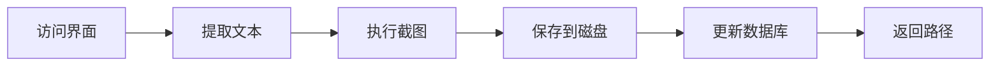
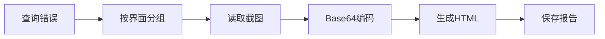

# 截图功能集成完成 ✅

## 更新内容

### 后端更新

#### 1. 数据库模型更新
**文件**: `backend/app/models.py`
- `InterfaceInfo` 表新增 `screenshot_path` 字段
- 用于存储每个界面的截图文件路径

#### 2. 爬虫模块增强
**文件**: `backend/app/core/crawler.py`
- 新增 `take_interface_screenshot()` 方法
- 修改 `crawl_interface()` 返回截图路径
- 截图保存在 `reports/screenshots/` 目录
- 文件命名格式: `task{任务ID}_interface_{界面ID}_{时间戳}.png`

#### 3. 报告生成器优化
**文件**: `backend/app/core/report_generator.py`
- HTML报告中集成界面截图（Base64编码）
- 按界面分组显示错误和截图
- 优化报告UI布局和视觉效果

#### 4. 新增API端点
**文件**: `backend/app/api/screenshots.py`
- `GET /api/screenshots/{interface_id}` - 获取界面截图

#### 5. 数据库迁移
**文件**: `backend/migrate_add_screenshot.py`
- 自动检测并添加 `screenshot_path` 字段

### 前端更新

#### 1. 界面配置页面
**文件**: `frontend/src/views/Interfaces.vue`
- 表格新增"截图"列
- 添加"查看截图"按钮
- 新增截图预览对话框

### 文档更新

#### 1. 主文档
**文件**: `README.md`
- 功能特性中添加截图功能说明
- 项目结构中添加screenshots目录
- 使用指南中添加截图功能说明
- API文档中添加截图API

#### 2. 功能说明文档
**文件**: `SCREENSHOT_FEATURE.md`
- 详细的功能介绍
- 使用方法说明
- 技术实现细节
- 配置和优化建议

## 使用方法

### 1. 对于已有数据库

如果您已经运行过旧版本，需要执行数据库迁移：

```bash
cd backend
python migrate_add_screenshot.py
```

或直接运行：
```bash
start.bat  # 会自动执行迁移
```

### 2. 对于新安装

直接运行 `start.bat` 或 `install.bat && start.bat`

### 3. 测试截图功能

```bash
cd backend
python test_screenshot.py
```

### 4. 查看截图

**方式1 - 在报告中查看**:
1. 创建并执行检查任务
2. 生成HTML报告
3. 报告中每个界面都包含截图

**方式2 - 在界面配置中查看**:
1. 进入"界面配置"页面
2. 点击有截图的界面的"查看截图"按钮

**方式3 - 通过API获取**:
```bash
curl -H "Authorization: Bearer {token}" \
  http://localhost:8000/api/screenshots/{interface_id} \
  --output screenshot.png
```

## 截图存储

- **位置**: `reports/screenshots/`
- **格式**: PNG
- **分辨率**: 1920x1080
- **大小**: 约1-2MB/张

## 报告示例

HTML报告中的截图展示：

```html
<div class="interface-section">
  <h3>登录界面 <span class="error-badge">3 个错误</span></h3>
  
  <div class="screenshot-container">
    <h4>界面截图</h4>
    
  </div>
  
  <h4>错误列表</h4>
  <table>
    <!-- 错误详情 -->
  </table>
</div>
```

## 技术细节

### 截图采集流程



### 报告生成流程



## 注意事项

1. **磁盘空间**: 截图会占用磁盘空间，建议定期清理
2. **报告大小**: 包含截图的HTML报告较大
3. **浏览器兼容**: 报告在Chrome、Firefox、Edge中测试通过
4. **权限要求**: 访问截图需要登录认证

## 性能优化建议

1. **定期清理**: 保留最近30天的截图
   ```bash
   # Linux/Mac
   find reports/screenshots -mtime +30 -delete
   
   # Windows (PowerShell)
   Get-ChildItem reports\screenshots | Where-Object {$_.LastWriteTime -lt (Get-Date).AddDays(-30)} | Remove-Item
   ```

2. **压缩存储**: 可配置图片压缩（未来功能）

3. **缩略图**: 生成缩略图提高报告加载速度（未来功能）

## 下一步计划

- [ ] 支持图片压缩
- [ ] 生成缩略图版本
- [ ] 截图标注错误位置
- [ ] 支持全页面截图（滚动）
- [ ] 截图比较功能

## 问题反馈

如遇到问题，请检查：
1. Chrome浏览器是否正确安装
2. ChromeDriver版本是否匹配
3. reports目录是否有写入权限
4. 磁盘空间是否充足

---

**版本**: v1.1.0  
**更新日期**: 2024-03-06  
**更新类型**: 功能增强
